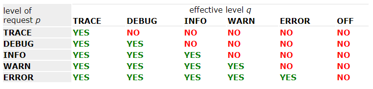

## java日志

在代码里打好日志对排查问题非常重要，代码的好坏可以从日志的输出窥见一斑，好的代码打出来的日志一定也是清晰明确的，从日志即可了解代码的运行过程。

在java世界里，日志库可谓五花八门，翻开项目的依赖可能就会看到`commons-logging.jar`、`log4j.jar`、`sl4j-api.jar`、`logback.jar`等等日志依赖。这么多日志依赖有必要理清其中的关系，以便在项目中更好的用好日志库。

本文仅梳理项目最常用的日志库组合`slf4j + logback`的使用，对于日志历史以及如何统一日志输出，可以参考以下文章：

- [Java日志体系总结](https://albenw.github.io/posts/854fc091/)
- [java日志历史及统一日志配置](https://zhuanlan.zhihu.com/p/367591121)

本文内容为阅读Logback文档做的笔记，详情可以阅读文档。
[https://logback.qos.sh/](https://logback.qos.sh/)

## Logback初体验

首先引入依赖，只要引入logback-classic，logback-classic会依赖logback-core和slf4j-api

```xml
<dependency>
    <groupId>ch.qos.logback</groupId>
    <artifactId>logback-classic</artifactId>
    <version>${logback.version}</version>
</dependency>
```

logback初体验，`LoggerFactory`的`getLogger`方法，然后传入类的全路径名或者当前类的class实例，无需任何配置即可以使用logback了。

```java
public class HelloLogback {
    public static void main(String[] args) {
        Logger logger = LoggerFactory.getLogger(HelloLogback.class);
        logger.info("Hello Logback");
    }
}
```

那logback启动具体做了什么呢，可以用其内置工具StatusPrinter查看。

```java
public class PrintLoggerStatus {
    public static void main(String[] args) {
        Logger logger = LoggerFactory.getLogger(PrintLoggerStatus.class);
        logger.debug("Hello logback.");
        LoggerContext lc = (LoggerContext)LoggerFactory.getILoggerFactory();
        StatusPrinter.print(lc);
    }
}
```

```
11:51:39.650 [main] DEBUG net.jyou.logbackdemo.PrintLoggerStatus - Hello logback.
11:51:39,540 |-INFO in ch.qos.logback.classic.LoggerContext[default] - This is logback-classic version 1.4.5
11:51:39,587 |-INFO in ch.qos.logback.classic.LoggerContext[default] - Could NOT find resource [logback-test.xml]
11:51:39,587 |-INFO in ch.qos.logback.classic.LoggerContext[default] - Could NOT find resource [logback.xml]
11:51:39,587 |-INFO in ch.qos.logback.classic.BasicConfigurator@4eb7f003 - Setting up default configuration.
```

可以看出，启动时先去找logback-test.xml和logback.xml配置文件了，如果没找到，就使用默认配置，即使用`ConsoleAppender`将日志输出到控制台。

项目的日志需求都是多样化的，那个性化的配置就可以放到其配置文件logback.xml里了。

## Logger, Appenders and Layouts三个重要概念

### Logger

日志API与`System.out.println`不同的一点是他们能输出指定日志类别的内容同时又能屏蔽其他类别的日志。一个Logger实例代表一个日志的记录器，他们在logback里通过LoggerContext按层级进行分类组织。层级按如下规则进行组织：

```
com
com.foo
com.foo.Bar
```

以`com`命名的Logger是以`com.foo`命名的Logger的父级，同时以`com.foo`的Logger又是以`java.util.Vector`命名的父级，依次类推。

Logger接口基础的方法如下：

```java
package org.slf4j; 
public interface Logger {

  // Printing methods: 
  public void trace(String message);
  public void debug(String message);
  public void info(String message); 
  public void warn(String message); 
  public void error(String message); 
}
```

### Logger生效日志等级和日志等级的继承性

Logger的日志等级具有继承性。如果没有给Logger赋予Level属性，那Logger的日志等级就从最近的有赋值Level的父Logger里继承，直到追溯到root Logger。root Logger总是会被赋予一个Level，默认是DEBUG。一个Logger的生效日志等级就是其赋予的日志等级或者最近继承的日志等级。我们来看两个实例：

实例1


| Logger name | Assigned level | Effective level |
| ------------- | ---------------- | ----------------- |
| root        | DEBUG          | DEBUG           |
| X           | none           | DEBUG           |
| X.Y         | none           | DEBUG           |
| X.Y.Z       | none           | DEBUG           |

在实例1中，只有root Logger赋予了DEBUG Level，其他Logger都直接继承至root的日志等级。

实例2


| Logger name | Assigned level | Effective level |
| ------------- | ---------------- | ----------------- |
| root        | DEBUG          | DEBUG           |
| X           | INFO           | INFO            |
| X.Y         | none           | INFO            |
| X.Y.Z       | ERROR          | ERROR           |

在实例2中，Logger X赋予了INFO，所以使用自己的日志等级，Logger X.Y没有赋予Level，则从最近的父级Logger X上继承，所以也为INFO。同理Logger X.Y.Z使用自己的ERROR Level。

### Logger日志筛选规则

当一个日志实例调用打印日志方法的时候，我们称其发起一个日志打印请求。比如一个日志实例`L`，对于语句`L.info("")`就称为L发起了打印info日志的请求。

> 当一个日志请求的等级p大于Logger生效日志等级q的时候，日志将被打印。否则日志打印请求被屏蔽。

日志等级大小排序如下：

`TRACE < DEBUG < INFO <  WARN < ERROR`.

我们以一个表格来说明：



### Logger命名

Logger可以以你任意想要的名称命名，当用统一名称多次调用`LoggerFactory.getLogger("xxx")`时，返回的是同一Logger实例。通常以类的全路径名来命名Logger。

### Appenders and Layouts

Appender实例即指日志的输出目的地。Logback可以将日志输出到多个目的地，比如console, files, remote socket servers, MySQL等数据库, JMS和UNIX Syslog。一个Logger可以指定多个Appender，即可以输出到多个目的地。

Logger有个Additivity属性，用于控制输出的行为是否向父级Logger传递，这个特性称为Appender Additivity。Additivity默认为true，子Logger会输出到所有父级Logger的Appender目的地。以下表为例，Logger security 的Additivity设置为false，Logger security的Appender为A-sec，那security子层级只会输出到security指定的Appender，security父级的x,x.y,x.y.z所指定的Appender则会被屏蔽。这里有一篇文章可以参考：https://skyao.github.io/2014/09/23/logback-additivity/


| Logger Name     | Attached Appenders | Additivity Flag | Output Targets         | Comment                                                                                                    |
| ----------------- | -------------------- | ----------------- | ------------------------ | ------------------------------------------------------------------------------------------------------------ |
| root            | A1                 | not applicable  | A1                     | Since the root logger stands at the top of the logger hierarchy, the additivity flag does not apply to it. |
| x               | A-x1, A-x2         | true            | A1, A-x1, A-x2         | Appenders of "x" and of root.                                                                              |
| x.y             | none               | true            | A1, A-x1, A-x2         | Appenders of "x" and of root.                                                                              |
| x.y.z           | A-xyz1             | true            | A1, A-x1, A-x2, A-xyz1 | Appenders of "x.y.z", "x" and of root.                                                                     |
| security        | A-sec              | **false**       | A-sec                  | No appender accumulation since the additivity flag is set to`false`. Only appender A-sec will be used.     |
| security.access | none               | true            | A-sec                  | Only appenders of "security" because the additivity flag in "security" is set to`false`.                   |

Layout实例用于指定日志的输出格式。通常日志除了指定输出目的地，还会指定日志的输出格式，Layout就是干这个的。

比如指定输出模式为："%-4relative [%thread] %-5level %logger{32} - %msg%n"

那它的输出就为：

```java
176  [main] DEBUG manual.architecture.HelloWorld2 - Hello world.
```

第一个参数表示程序启动到日志打印的毫秒数，第二个参数指定现场，第三个参数指定日志等级，第四个参数指定打印该日志的Logger名称，最后指定日志的内容和一个换行符。··

### 参数化logging

我们将说明几种记录日志的方式，并说明其性能和可读性上的差别

第一种方式如下，这种方式不管是否记录debug日志，都会触发字符串拼接的执行，并且以字符串拼接的方式可读性差。

```java
logger.debug("Entry number: " + i + " is " + String.valueOf(entry[i]));
```

第二种方式，我们在打日志前先做个检测。这在性能上有所提升，但是可读性上还是不行。注意，这里的性能通常影响比较小。

```java
if(logger.isDebugEnabled()) { 
  logger.debug("Entry number: " + i + " is " + String.valueOf(entry[i]));
}
```

第三种方式，也是推荐使用的方式。这种性能最后，可读性也最佳。

```java
logger.debug("The new entry is {}. It replaces {}.", entry, oldEntry);
```


## logback配置

顶层节点configuration，可以配置三个属性

- scan: 配置文件变更是自动更新，默认true
- scanPeriod: 配置文件变更扫描频率，默认1min，单位默认为milisecond
- debug:如果为true，则解析logback.xml出错时，打印内部日志

configuration

- appender
  - 属性
    - name: 必填
    - class：必填，Appender实现类全限定名称
  - 子节点
    - encoder：默认`PatternLayoutEncoder`，Encoder实现类全限定名称
    - filter：class必填，Filter实现类全限定名称
    - layout：默认`PatternLayout`，Layout实现类全限定名称
- logger
  - name:必填
  - level: 可选，默认DEBUG
  - additivity：配置Appender additivity行为
- root

配置示例：

```xml
<?xml version="1.0" encoding="UTF-8"?>
<!--scan:
            当此属性设置为true时，配置文件如果发生改变，将会被重新加载，默认值为true。
scanPeriod:
            设置监测配置文件是否有修改的时间间隔，如果没有给出时间单位，默认单位是毫秒。当scan为true时，此属性生效。默认的时间间隔为1分钟。
debug:
            当此属性设置为true时，将打印出logback内部日志信息，实时查看logback运行状态。默认值为false。

configuration 子节点为 appender、logger、root

            -->
<configuration scan="true" scanPeriod="60 seconds" debug="false">
    <!--用于区分不同应用程序的记录-->
    <contextName>edu-cloud</contextName>
    <!--日志文件所在目录，如果是tomcat，如下写法日志文件会在则为${TOMCAT_HOME}/bin/logs/目录下-->
    <property name="LOG_HOME" value="logs"/>

    <!--控制台-->
    <appender name="stdout" class="ch.qos.logback.core.ConsoleAppender">
        <encoder>
            <!--格式化输出：%d表示日期，%thread表示线程名，%-5level：级别从左显示5个字符宽度 %logger输出日志的logger名 %msg：日志消息，%n是换行符 -->
            <pattern>[%d{yyyy-MM-dd HH:mm:ss.SSS}] [%thread] %-5level %logger{36} : %msg%n</pattern>
            <!--解决乱码问题-->
            <charset>UTF-8</charset>
        </encoder>
    </appender>

    <!--滚动文件-->
    <appender name="infoFile" class="ch.qos.logback.core.rolling.RollingFileAppender">
        <!-- ThresholdFilter:临界值过滤器，过滤掉 TRACE 和 DEBUG 级别的日志 -->
        <filter class="ch.qos.logback.classic.filter.ThresholdFilter">
            <level>INFO</level>
        </filter>
        <rollingPolicy class="ch.qos.logback.core.rolling.TimeBasedRollingPolicy">
            <fileNamePattern>${LOG_HOME}/log.%d{yyyy-MM-dd}.log</fileNamePattern>
            <maxHistory>30</maxHistory><!--保存最近30天的日志-->
        </rollingPolicy>
        <encoder>
            <charset>UTF-8</charset>
            <pattern>[%d{yyyy-MM-dd HH:mm:ss.SSS}] [%thread] %-5level %logger{36} : %msg%n</pattern>
        </encoder>
    </appender>

    <!--滚动文件-->
    <appender name="errorFile" class="ch.qos.logback.core.rolling.RollingFileAppender">
        <!-- ThresholdFilter:临界值过滤器，过滤掉 TRACE 和 DEBUG 级别的日志 -->
        <filter class="ch.qos.logback.classic.filter.ThresholdFilter">
            <level>error</level>
        </filter>
        <rollingPolicy class="ch.qos.logback.core.rolling.TimeBasedRollingPolicy">
            <fileNamePattern>${LOG_HOME}/error.%d{yyyy-MM-dd}.log</fileNamePattern>
            <maxHistory>30</maxHistory><!--保存最近30天的日志-->
        </rollingPolicy>
        <encoder>
            <charset>UTF-8</charset>
            <pattern>[%d{yyyy-MM-dd HH:mm:ss.SSS}] [%thread] %-5level %logger{36} : %msg%n</pattern>
        </encoder>
    </appender>

    <!--将日志输出到logstack-->
    <!--<appender name="logstash" class="net.logstash.logback.appender.LogstashTcpSocketAppender">
        <destination>47.93.173.81:7002</destination>
        <encoder class="net.logstash.logback.encoder.LogstashEncoder">
            <charset>UTF-8</charset>
        </encoder>
        <keepAliveDuration>5 minutes</keepAliveDuration>
    </appender>-->

    <!--这里如果是info，spring、mybatis等框架则不会输出：TRACE < DEBUG < INFO <  WARN < ERROR-->
    <!--root是所有logger的祖先，均继承root，如果某一个自定义的logger没有指定level，就会寻找
    父logger看有没有指定级别，直到找到root。-->
    <root level="debug">
        <appender-ref ref="stdout"/>
        <appender-ref ref="infoFile"/>
        <appender-ref ref="errorFile"/>
        <appender-ref ref="logstash"/>
    </root>

    <!--为某个包单独配置logger

    比如定时任务，写代码的包名为：com.seentao.task
    步骤如下：
    1、定义一个appender，取名为task（随意，只要下面logger引用就行了）
    appender的配置按照需要即可


    2、定义一个logger:
    <logger name="com.seentao.task" level="DEBUG" additivity="false">
      <appender-ref ref="task" />
    </logger>
    注意：additivity必须设置为false，这样只会交给task这个appender，否则其他appender也会打印com.seentao.task里的log信息。

    3、这样，在com.seentao.task的logger就会是上面定义的logger了。
    private static Logger logger = LoggerFactory.getLogger(Class1.class);
    -->

</configuration>

```
